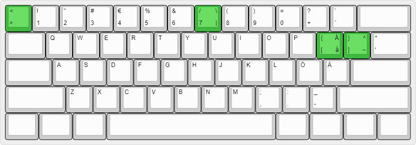

# Finsi

This is a keyboard layout mainly aimed at people who are used to the [Finnish ISO layout](https://en.wikipedia.org/wiki/QWERTY#Finnish_multilingual) but want a layout that's a bit better suited for software development, don't want to throw out years worth of muscle memory and want a more consistent typing experience between Windows and macOS on both common physical keyboard layouts, [ANSI and ISO](https://en.wikipedia.org/wiki/Keyboard_layout#/media/File:Physical_keyboard_layouts_comparison_ANSI_ISO_KS_ABNT_JIS.png).

## Layout

Here's what the layout looks like (when used on an ANSI keyboard). Changes to the standard Finnish layout are highlighted:

Features:

* Access `[`, `]`, `{` and `}` from the same ergonomic spot as on the US and UK layouts.
* Access `<`, `>`, `/`, `|` and `\` consistently from the same keys no matter the OS or the physical layout you happen to be on.
* Access `ä`, `Ä`, `ö` and `Ö` from the same physical keys as the standard Finnish layout.
* `å`/`Å` is moved under <kbd>Alt(Gr)</kbd> because `[` and `{` are more important to most Finnish-speaking developers.
* Access the other characters the same way as on the standard Finnish layout on each OS.
* All the keys are in the same places on both ANSI and ISO physical layouts.
  * Note that the location of the <kbd>* '</kbd> key is always going to be slightly different because, you know, geometry (due to the shape of the enter key). You just need to live with this if you need to switch between ANSI and ISO.
  
Check the ["Comparison of alternatives" section](https://github.com/samulisuomi/finsi#comparison-of-alternatives) for motivation behind this feature set.

## Installation

1. Download <https://github.com/samulisuomi/finsi/archive/master.zip>
1. Unzip.
2. Install the layout for your OS:
   * macOS: Unzip `macOS\Finnish - US Influenced.bundle.zip` and then see e.g. [these instructions](https://weibeld.net/mac/custom-keyboard-layout.html) on how to install the `.keylayout` file found under `Contents/Resources`.
   * Windows: Run the installer from `Windows\finnishu\setup.exe`.
   * Linux: Sorry, no Linux version available as of now. :(

The layout files were created in [Ukelele](http://software.sil.org/ukelele/) and [Microsoft Keyboard Layout Creator](https://www.microsoft.com/en-us/download/details.aspx?id=102134).

## Dead keys

The characters with [dead key](https://en.wikipedia.org/wiki/Dead_key) behavior in the original Finnish layout behave the same way in this layout. For instance, hitting <kbd>Alt(Gr)</kbd> + <kbd>¨ ^ ~</kbd> doesn't print `~` before you also hit the space bar. However, both `]` and `}` (accessible via the same key) appear instantly (like on US ANSI).

A "no dead keys" variant may come in the future.

## Naming

The layout is still called `Finnish - US Influenced` in the downloadable layout files as I haven't had time to regenerate them with the new name. Sry.

## Limitations and caveats

* You completely lose access to `¨` compared to the original Finnish layouts (I'm sorrü).
* You will be able to enter some of the characters from multiple different keys (e.g. on Windows you can enter `\` both from the standard <kbd>+</kbd> key and from the new modified <kbd>7</kbd> key).

## Comparison of alternatives

At the time of creating this layout (somewhere around 2017) I had come across both EurKEY and Swerty but didn't like either of them. Anyway, be sure to check out these alternatives if something grinds your gears about Finsi:

* [EurKEY](https://eurkey.steffen.bruentjen.eu/)
  * Pros: Native ANSI layout which is great for software development.
  * Cons: You need to access `ä` and `ö` with <kbd>Alt(Gr)</kbd>. Need to completely retrain your muscle memory for special characters.
* [Finner](https://github.com/ruohola/finner)
  * Pros: Very few changes compared to the Finnish layout. `[`, `]`, `{` and `}` are in the same keys as on ANSI.
  * Cons: Doesn't work on a physical ANSI layout as it requires all the ISO keys to keep backtick, `<` and `>` all functional.
* [Swerty](http://johanegustafsson.net/projects/swerty/)
  * Pros: Great for people who write a lot of Swedish since `å` is kept directly accessible.
  * Cons: Need to hit <kbd>Alt(Gr)</kbd> to access `[`, `]`, `{` and `}`.
